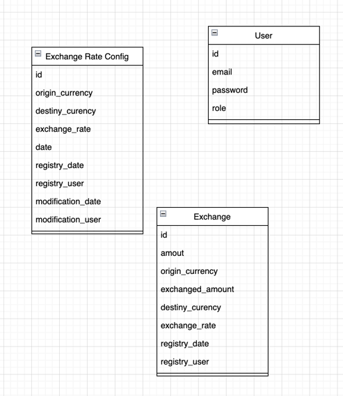

# springboot-exchange-rate-app


Minimal [Spring Boot](http://projects.spring.io/spring-boot/) sample app.

## Requerimientos

Para construir y ejecutar la aplicación necesita lo siguiente:

- [JDK 11](http://www.oracle.com/technetwork/java/javase/downloads/jdk8-downloads-2133151.html)
- [Maven 3](https://maven.apache.org)

## Ejecutar la aplicación localmente

Para ejecutar la aplicación puede ejecutar el siguiente comando:

```shell
mvn spring-boot:run
```

## Estructura de tablas

